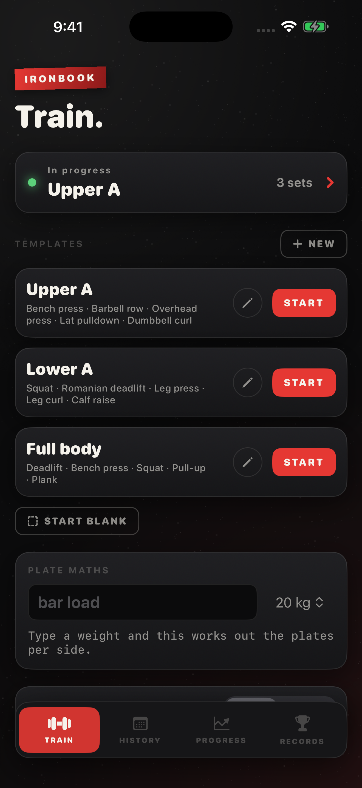
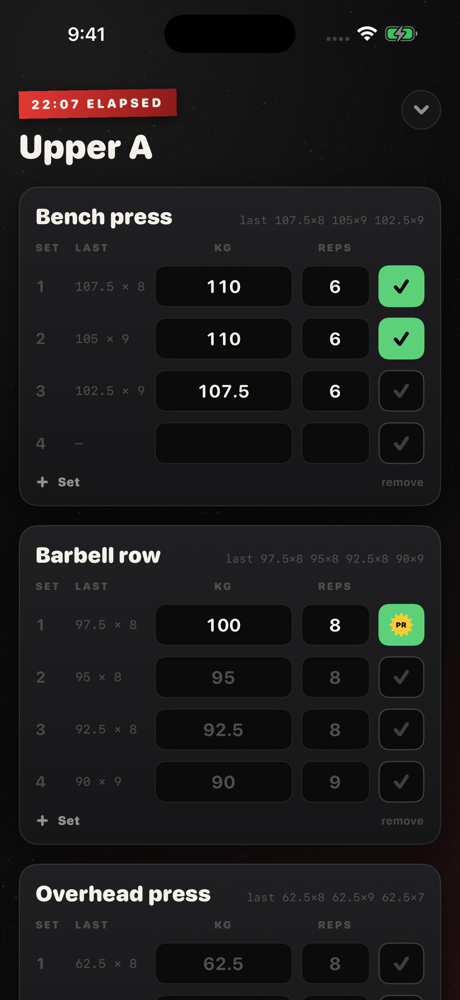
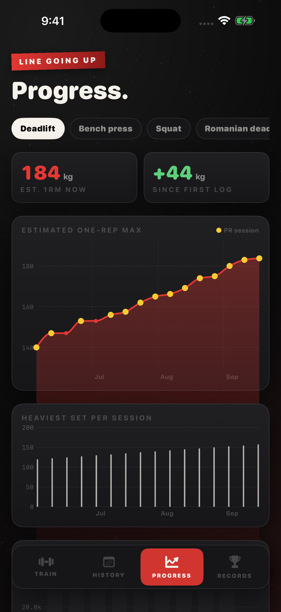

# Ironbook

A workout log for iPhone with the look of a gym blackboard: chalk on iron, red tape, gold for records.

  

**[Download Ironbook on the App Store](https://apps.apple.com/app/id6814264434)** (version 1.1, which makes it free, is in review)

<p align="center">
  
  
  
</p>

The whole point of a training log is knowing what you did last time while you stand at the bar. Ironbook puts that number next to every set, starts the rest timer when you tick it, and then draws the line going up.

## Features

- Unlimited workouts, templates and history; start from a template or blank
- Every set shows last session's weight and reps; ticking an empty set copies them
- Ticking a set starts a rest timer (1:00, 1:30, 2:00 or 3:00) with a buzz when it is time
- Add exercises and sets on the fly; finishing tells you if you set a PR
- Repeat any past workout with one tap; kg or lb

## Free and Pro

Version 1.1 (in App Store review) makes Ironbook free, with one optional non-consumable in-app purchase, **Ironbook Pro** (StoreKit 2, `Sources/Pro.swift`). No subscription. Logging is free forever; Pro is the analysis layer.

| Free | Ironbook Pro (one-time) |
| --- | --- |
| Unlimited workouts, templates and history | Progress: estimated 1RM over time (Epley), PR sessions in gold, weekly volume |
| Last-time numbers on every set, rest timer, PR detection | Records: est. 1RM, best set and heaviest set for every lift |
| Repeat any workout | Plate maths for any bar |
| Three starter templates | Program library: 5x5, push pull legs, upper lower, full body, dumbbells only |

Anyone whose original App Store purchase date is before the moment the price went to free (read from `AppTransaction`, production only) keeps Pro automatically.

## Privacy

Ironbook makes no network requests of its own; the only traffic is StoreKit talking to Apple for the purchase. No account, no analytics, no ads, no tracking. Workouts are saved on the device in `ironbook.json`. The privacy manifest (`Resources/PrivacyInfo.xcprivacy`) declares no tracking and no collected data types.

## Built without a Mac

This app was written on a Windows PC. No Mac is involved at any point: every build, signature, screenshot and App Store submission runs on GitHub Actions macOS runners, driven by the App Store Connect API.

- **`project.yml`** is an [XcodeGen](https://github.com/yonaskolb/XcodeGen) spec. The `.xcodeproj` is generated on the runner and never committed, so the repo can be edited on any OS and there are no `.pbxproj` merge conflicts.
- **`.github/workflows/build.yml`** runs on every push: picks the newest Xcode 26 and iPhone simulator on the runner, builds, then launches the app once per screen with `-shot <screen>` (sample data, fixed 9:41 status bar) and captures the store screenshots with `simctl`, uploaded as a workflow artifact.
- **`.github/workflows/appstore.yml`** (manual) has three modes: `compile`, `dry_run` (build, sign, upload, do not submit) and `release` (also submits for review). The distribution certificate is imported from a secret into a throwaway keychain; [fastlane](https://fastlane.tools) (`fastlane/Fastfile`) fetches the App Store profile with the API key, sets the build number one above the latest on TestFlight, archives, and uploads the binary with `fastlane/metadata` and the committed `fastlane/screenshots`.
- **`.github/workflows/review-video.yml`** records the App Review screen recording: the app is launched with `-demoAutoplay` and drives its own real screens.
- **`Store/*.py`** talk to the App Store Connect API directly from Windows (Python, `requests` + `PyJWT`): `asc.py` registers the bundle id and pushes metadata, `listing.py` sets the age rating, review details, price and screenshots, `iap.py` creates the in-app purchase, sets its price and submits it, and `signing.py` creates the distribution certificate locally so its private key is never stranded on a disposable runner.

Only one step is manual: Apple's API will not create the app record itself, so that is made once in the App Store Connect web UI.

## Build and run

With a Mac and Xcode 26 (the version CI uses; the app targets iOS 17+):

```bash
brew install xcodegen
xcodegen generate
open Ironbook.xcodeproj
```

Run the `Ironbook` scheme on any iPhone simulator. No signing is needed for the simulator; from the command line:

```bash
xcodebuild build -project Ironbook.xcodeproj -scheme Ironbook \
  -destination 'platform=iOS Simulator,name=iPhone 16 Pro' CODE_SIGNING_ALLOWED=NO
```

To see it filled with sample data, launch with a screenshot argument, e.g. `xcrun simctl launch booted com.mattbusel.ironbook -shot train`.

Without a Mac: fork the repo and push. The Build workflow compiles it on a GitHub macOS runner and attaches the screenshots as an artifact.

Shipping your own build needs these repository secrets: `ASC_KEY_ID`, `ASC_ISSUER_ID`, `ASC_KEY_CONTENT` (base64 of the `.p8`), `DEVELOPMENT_TEAM`, `DIST_CERT_P12`, `DIST_CERT_PASSWORD`, plus your own bundle id in `project.yml` and `fastlane/Fastfile`.

## Code map

All app code is in `Sources/` (SwiftUI, Observation, no third-party dependencies).

| File | What it does |
| --- | --- |
| `App.swift` | entry point, tabs, `-shot` handling, paywall routing |
| `Model.swift` | workouts, sets, templates, Epley 1RM, JSON persistence |
| `TrainView.swift` | the Train tab: templates, programs, plate calculator |
| `LiveSessionView.swift` | the workout in progress with last-time numbers and the rest timer |
| `StatsViews.swift` | history, progress charts (Swift Charts) and records |
| `Pro.swift` | StoreKit 2 unlock, grandfathering, the paywall |
| `Theme.swift` | chalk-on-iron look |
| `Demo.swift` | sixteen weeks of sample training for screenshots |
| `Autopilot.swift` | drives the real screens for the App Review recording |

`Store/` holds the App Store Connect scripts, `fastlane/` the lanes, listing text and screenshots, `Resources/` the asset catalog and privacy manifest.

---

**More apps built the same way:** [Chain](https://github.com/Mattbusel/chain), [Quiver](https://github.com/Mattbusel/quiver), [Race Fuel](https://github.com/Mattbusel/race-fuel), [Minder](https://github.com/Mattbusel/minder), [Baseline Ledger](https://github.com/Mattbusel/baseline-ledger), [Fairway Ledger](https://github.com/Mattbusel/fairway-ledger), [Odometer](https://github.com/Mattbusel/odometer), [Rooms](https://github.com/Mattbusel/rooms), [Clockout](https://github.com/Mattbusel/clockout), [Curve](https://github.com/Mattbusel/curve), [Pricebook](https://github.com/Mattbusel/pricebook), [Chores](https://github.com/Mattbusel/chores), [Pawprint](https://github.com/Mattbusel/pawprint), [Pocket Beings](https://github.com/Mattbusel/pocket-beings), [Glyphstorm](https://github.com/Mattbusel/glyphstorm), [Clear the Strait](https://github.com/Mattbusel/clear-the-strait).


## Hire the author

I designed, built and shipped this app myself. **Want one like it for your business?** I build native iOS apps from prototype to App Store launch, fixed price. [Services and pricing](https://mattbusel.github.io/) · [Email](mailto:mattbusel@gmail.com) · [LinkedIn](https://www.linkedin.com/in/matthewbusel/)
